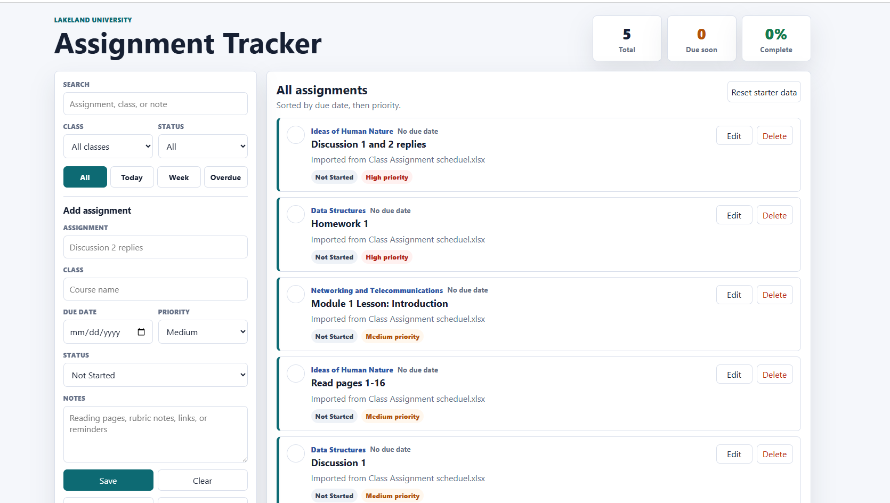

# Lakeland Assignment Tracker

A web-based assignment tracking application built to help students organize coursework, deadlines, and academic priorities.

## Application Preview

## Features

- Track assignments by course
- Monitor upcoming deadlines
- Organize coursework and projects
- Prioritize academic tasks
- Simple and responsive interface

## Technologies Used

- HTML5
- CSS3
- JavaScript
- Git
- GitHub

## Purpose

This project was developed while pursuing a Bachelor of Science in Computer Science at Lakeland University. The goal was to create a practical productivity tool that improves academic organization and time management.

## Future Enhancements

- User accounts
- Assignment reminders
- Calendar integration
- Grade tracking
- Mobile optimization

## Author

Chris Kriticos
